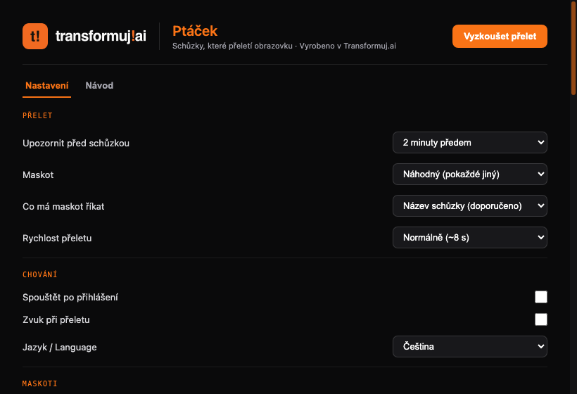

# Ptáček 🐦

*(“Ptáček” is Czech for “little bird” — pronounced roughly “PTAH-check”.)*

**Meetings that fly across your screen.** A few minutes before a meeting, a mascot flies across your monitor with a heads-up — over every window, including full-screen presentations. Impossible to miss, gone in seconds.

Made by [Transformuj.ai](https://transformuj.ai) · macOS 12+ · free · MIT

🇨🇿 [Česká verze README](README.md)



## What it does

- **10 mascots** as pure CSS/SVG animations: orange bird, paper plane, banner plane, cat, delivery drone, courier robot, formula car, hot-air balloon, a flock that spells out a word, and an 8-bit pixel bird
- **Calendar sources**: Apple Calendar via in-process EventKit (which also covers Google/Outlook accounts connected in System Settings), or a secret iCal URL stored in the macOS Keychain — no OAuth, no account setup
- **Hover** to freeze the mascot mid-flight, see the meeting details, and snooze it 5 minutes; clicks outside the mascot pass straight through to the app below
- **What the mascot says**: the meeting name, a generic witty line (reveals nothing — handy when sharing your screen), or both
- **Settings**: minutes before, mascot, flyby speed, which calendars to watch, sound, mute for an hour or the day, launch at login, Czech/English, and a built-in guide
- **Quiet by design**: the overlay window only exists during a flyby — 0% CPU the rest of the time

## Privacy

No servers, no telemetry, no analytics. The only network connection the app ever makes is to the optional iCal address you enter yourself (HTTPS only, with size limits and SSRF guards). Calendar data never leaves your Mac. The code is open precisely so you can verify that.

## Install

1. Download the DMG from Releases and drag Ptáček to Applications.
2. First launch: macOS shows a warning because the app is not signed with a paid Apple certificate — we ship it free and without a middleman. Open **System Settings → Privacy & Security → Open Anyway**.
3. Ptáček now sits in your menu bar. Open Settings, grant calendar access, and hit “Try a flyby”.

Note: because the build is unsigned, macOS asks for calendar permission again after each update — it treats the new version as a new app.

## Development

```bash
npm install
npx tauri dev     # development
npx tauri build   # production DMG
cargo test --manifest-path src-tauri/Cargo.toml   # tests, incl. ICS security fixtures
```

Stack: Tauri v1 + React + TypeScript, EventKit through objc2, mascots as plain CSS/SVG. Security architecture: minimal Tauri allowlist, CSP that gives the webview no network at all, event titles rendered exclusively as text nodes, sanitisation of control and bidi characters, and a hardened ICS pipeline (HTTPS only, redirect revalidation, 5 MB stream cap, 500-event cap, RRULE expansion with a hard instance limit).

Code comments are in Czech — the app was built by a Czech team and we kept the voice.

## Support

Ptáček is a gift to the community, not a supported product. Feel free to open an issue; we don't promise fixes or new features. Pull requests are welcome.

## Licence and warranty

MIT. The app is provided “as is”, without any warranty; we accept no liability for damages arising from its use. Ptáček was designed and built by Appmine, s.r.o. and its Transformuj.ai project — when redistributing or presenting the app, please credit the Transformuj.ai team.

---

*Using Ptáček? You get 10% off Transformuj.ai services and selected partners — just get in touch and mention Ptáček.*
